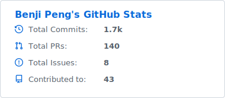
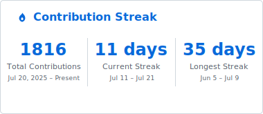

<!-- Bespoke animated banner with day/night variants (assets/header*.svg): glowing AppCubic cube, console scanline, blinking cursor. -->
<a href="https://appcubic.com"><picture>
  <source media="(prefers-color-scheme: light)" srcset="https://raw.githubusercontent.com/benjipeng/benjipeng/main/assets/header-light.svg" />
  
</picture></a>

---

> Founder of **[AppCubic](https://appcubic.com)** — an applied AI venture studio. I turn research-grade
> AI into systems teams can actually run: agent workflows with clear tool boundaries, honest evaluation
> loops, and the products that grow out of them.

### 🧪 What I'm building

- **[App Automaton](https://github.com/appautomaton)** — the studio's open workshop. Portable skills for
  coding agents, document & web tooling, multi-agent orchestration, and pure-MLX models for Apple
  Silicon. MIT-licensed, built in public, used daily inside the studio.
- **[AppCubic Research](https://research.appcubic.com)** — scientific and analytical workflows turned
  into dependable, repeatable systems.
- **Venture & advisory** — early product strategy, technical diligence, and incubation for AI-first teams.

### 🧰 Working with

### 📊 Stats

<!-- Personal overview + contribution streak. Static SVGs generated by .github/workflows/readme-cards.yml (no external stats hosts — everything self-hosted). Day/night via <picture>. -->
<picture>
  <source media="(prefers-color-scheme: dark)" srcset="./profile/stats-dark.svg" />
  
</picture>
<picture>
  <source media="(prefers-color-scheme: dark)" srcset="./profile/streak-dark.svg" />
  
</picture>

<!-- Contribution snake with a bespoke palette (.github/workflows/snake.yml): blue->cyan grid, luminous snake. Generated to the `output` branch; day/night via <picture>. -->
<picture>
  <source media="(prefers-color-scheme: dark)" srcset="https://raw.githubusercontent.com/benjipeng/benjipeng/output/snake-dark.svg" />
  
</picture>

### 🤖 App Automaton — the studio's open workshop

<!-- Stacked pins (1-col). Drawn at 240×134: symmetric pad, content-box fill, meta spans full width. -->

<a href="https://github.com/appautomaton/latex-arxiv-SKILL">
  <picture>
    <source media="(prefers-color-scheme: dark)" srcset="https://raw.githubusercontent.com/benjipeng/benjipeng/main/profile/pin-appautomaton-latex-arxiv-SKILL-dark.svg?v=12" />
    
  </picture>
</a>
<a href="https://github.com/appautomaton/document-SKILLs">
  <picture>
    <source media="(prefers-color-scheme: dark)" srcset="https://raw.githubusercontent.com/benjipeng/benjipeng/main/profile/pin-appautomaton-document-SKILLs-dark.svg?v=12" />
    
  </picture>
</a>
<a href="https://github.com/appautomaton/agent-designer">
  <picture>
    <source media="(prefers-color-scheme: dark)" srcset="https://raw.githubusercontent.com/benjipeng/benjipeng/main/profile/pin-appautomaton-agent-designer-dark.svg?v=12" />
    
  </picture>
</a>
<a href="https://github.com/appautomaton/presentation">
  <picture>
    <source media="(prefers-color-scheme: dark)" srcset="https://raw.githubusercontent.com/benjipeng/benjipeng/main/profile/pin-appautomaton-presentation-dark.svg?v=12" />
    
  </picture>
</a>

…and more open source across <a href="https://github.com/appautomaton">@appautomaton</a> →

### 🔗 Find me

